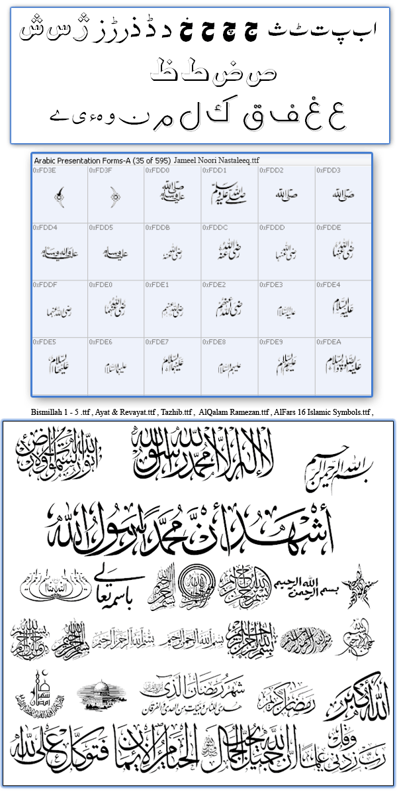



## Urdu, Arabic, Persian Font's Collection with Islamic Calligraphic Fonts

### Description

Pre-Requirements : Pak Urdu Installer Or East Asian Language Support (XP)

 http://www.mbilalm.com/download/ 

 The largest collection of Urdu, Arabic & Persian fonts on one place. There are 391 fonts with Arabic & Persian fonts that are supporting three languages in different ways. Random fonts are available on different websites but not collected available at anywhere to be download. So, these fonts collected from different websites to use them with VB6, VB.Net & for other applications. Most demanded Islamic Calligraphic fonts are also included in this collection that make Urdu, Arabic & Persian demanding solutions very easy. Specially, Bismillah fonts 1-5, Ayat & Riwayat, Tazhib, Al-Qalam Gul-o-Boota & Al-Qalam Remezan fonts etc. The updated version of Jameel Noori Nastaleeq V4.0 with Kasheeda also included that generate very beautiful Urdu script. Much more beautiful & stylish fonts included that will be liked by you. Like before, waiting for your feedback for this effort. Making Urdu, Arabic & Persian solutions not only for ME but also for you all. Thank You. 

 Join Urdu Programming at Facebook 

 http://www.facebook.com/pages/Urdu-Programming-VB6/263338567072301 
 
### More Info
 

             |
---                |---
**Submitted On**   |2011-07-10 18:54:52
**By**             |[Mehmood Iqbal](https://github.com/Planet-Source-Code/PSCIndex/blob/master/ByAuthor/mehmood-iqbal.md)
**Level**          |Intermediate
**User Rating**    |5.0 (10 globes from 2 users)
**Compatibility**  |VB 6\.0, ASP \(Active Server Pages\) , VBA MS Access, VBA MS Excel
**Category**       |[Files/ File Controls/ Input/ Output](https://github.com/Planet-Source-Code/PSCIndex/blob/master/ByCategory/files-file-controls-input-output__1-3.md)
**World**          |[Visual Basic](https://github.com/Planet-Source-Code/PSCIndex/blob/master/ByWorld/visual-basic.md)
**Archive File**   |[Urdu\_\_Arab2207847102011\.zip](https://github.com/Planet-Source-Code/mehmood-iqbal-urdu-arabic-persian-font-s-collection-with-islamic-calligraphic-fonts__1-74004/archive/master.zip)

